<p align="center">
  
  
  
  
  
</p>

<h1 align="center">🤖 BrowserPilot</h1>

<p align="center">
  <strong>A fully autonomous browser agent that navigates the web,<br/>
  fills forms, extracts data, and completes multi-step tasks<br/>
  from plain English instructions.</strong>
</p>

<p align="center">
  <a href="#-features">Features</a> •
  <a href="#-architecture">Architecture</a> •
  <a href="#-quick-start">Quick Start</a> •
  <a href="#-usage">Usage</a> •
  <a href="#-api-reference">API</a> •
  <a href="#-how-it-works">How It Works</a> •
  <a href="#-configuration">Config</a> •
  <a href="#-testing">Testing</a> •
  <a href="#-contributing">Contributing</a>
</p>

---

## 🎯 What is BrowserPilot?

BrowserPilot is an AI-powered autonomous browser agent that
interprets natural language instructions and executes complex
web tasks without human intervention. It combines **GPT-4o's
multimodal vision** with **Playwright's browser automation** to
create an agent that can _see_, _think_, and _act_ on any website.

```
"Research the top 5 AI startups of 2025 and fill this spreadsheet"
                              ↓
                     🤖 BrowserPilot
                              ↓
         ✅ Opens Google → Searches → Reads articles
         ✅ Extracts company names, funding, descriptions
         ✅ Navigates to spreadsheet → Fills in data
         ✅ Verifies completion → Reports results
```

---

## ✨ Features

| Feature | Description |
|---------|-------------|
| 🧠 **Vision-Grounded Actions** | Screenshots → GPT-4o → Intelligent decisions |
| 📋 **Task Decomposition** | Breaks complex instructions into atomic steps |
| ✅ **Anti-Hallucination** | Verifies every action against live DOM state |
| 🔍 **Critic Validation** | Sub-agent validates task completion criteria |
| 🌐 **Multi-Browser** | Chromium, Firefox, and WebKit support |
| 🔌 **REST & WebSocket API** | FastAPI server for external integrations |
| 📡 **Real-Time Streaming** | SSE/WebSocket for live progress updates |
| 🛡️ **Stealth Mode** | Anti-detection for bot-resistant sites |
| 📸 **Screenshot Artifacts** | Before/after screenshots for every action |
| 🔄 **Error Recovery** | Automatic retry with intelligent re-planning |
| ⚡ **CLI & API Modes** | Run from terminal or integrate via REST |
| 📊 **Structured Extraction** | Extract tables, text, and structured data |

---

## 🏗️ Architecture

### High-Level System Architecture

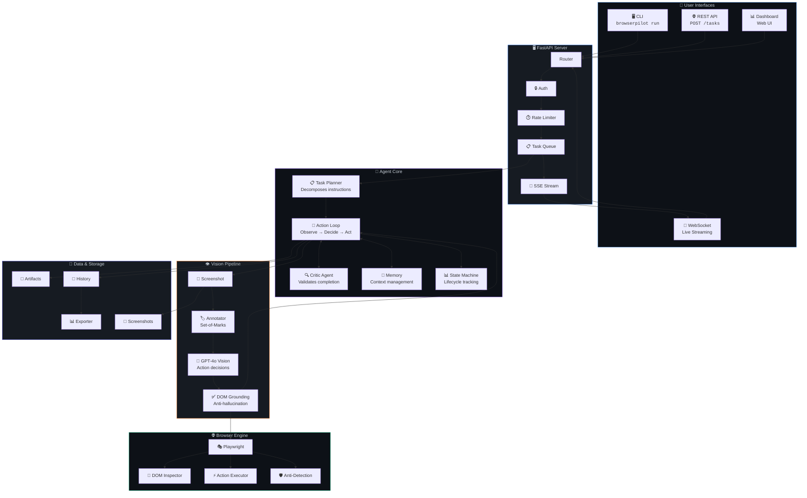

---

### Agent Decision Flow

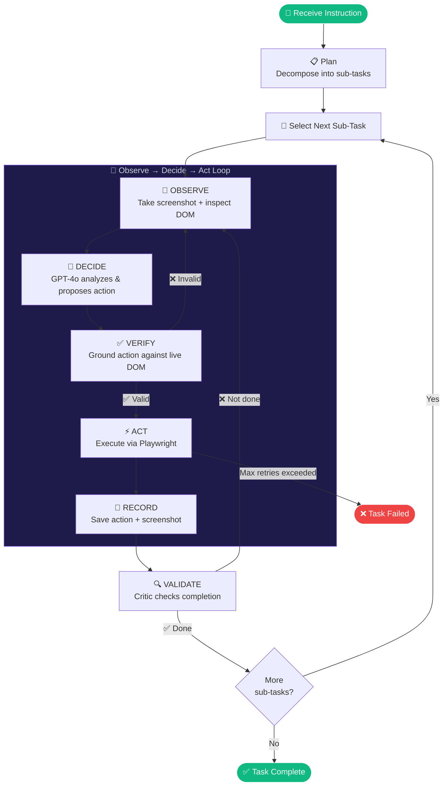

---

### Component Interaction Sequence

```mermaid
sequenceDiagram
    actor User
    participant CLI as 🖥️ CLI
    participant API as 🌐 FastAPI
    participant Planner as 📋 Planner
    participant Loop as 🔄 Action Loop
    participant Vision as 👁️ Vision
    participant Browser as 🌐 Browser
    participant Ground as ✅ Grounder
    participant Critic as 🔍 Critic
    participant LLM as 🧠 GPT-4o

    User->>CLI: browserpilot run "Search for..."
    CLI->>API: POST /api/v1/tasks

    rect rgb(30, 27, 75)
        Note over Planner,LLM: Phase 1: Task Planning
        API->>Planner: plan(instruction)
        Planner->>LLM: Decompose into sub-tasks
        LLM-->>Planner: [sub_task_1, sub_task_2, ...]
    end

    rect rgb(20, 83, 45)
        Note over Loop,Browser: Phase 2: Execution Loop
        loop For each sub-task
            loop Until sub-task complete
                Loop->>Browser: screenshot()
                Browser-->>Loop: 📸 image
                Loop->>Browser: inspect_dom()
                Browser-->>Loop: 🌳 DOM tree

                Loop->>Vision: annotate(image, DOM)
                Vision-->>Loop: 🏷️ annotated image

                Loop->>LLM: What action should I take?
                LLM-->>Loop: click(element #7)

                Loop->>Ground: verify(action, DOM)
                alt Action is grounded
                    Ground-->>Loop: ✅ verified
                    Loop->>Browser: execute(click #7)
                    Browser-->>Loop: ✅ success
                else Action hallucinated
                    Ground-->>Loop: ❌ rejected
                    Note over Loop: Re-observe page
                end
            end

            Loop->>Critic: Is sub-task done?
            Critic->>LLM: Evaluate completion
            LLM-->>Critic: ✅ / ❌
        end
    end

    Loop-->>API: TaskResult
    API-->>CLI: ✅ Task completed
    CLI-->>User: Results displayed
```

---

### Vision Pipeline Architecture

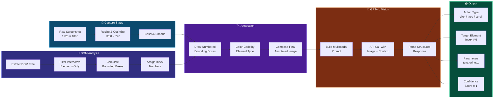

---

### Anti-Hallucination Grounding System

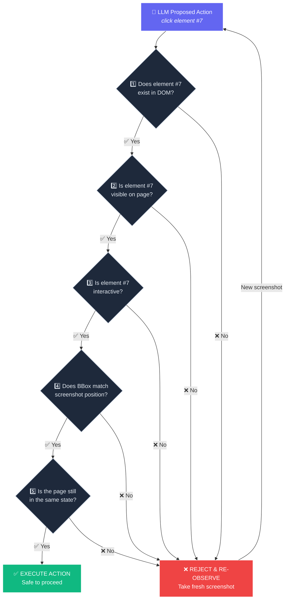

---

### Task Decomposition Example

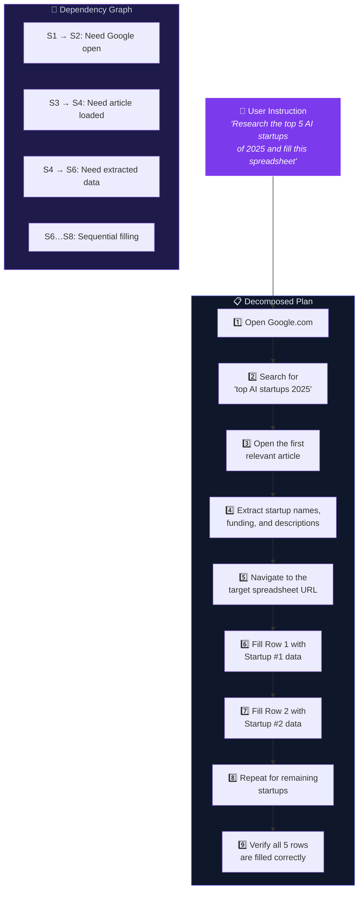

---

### State Machine

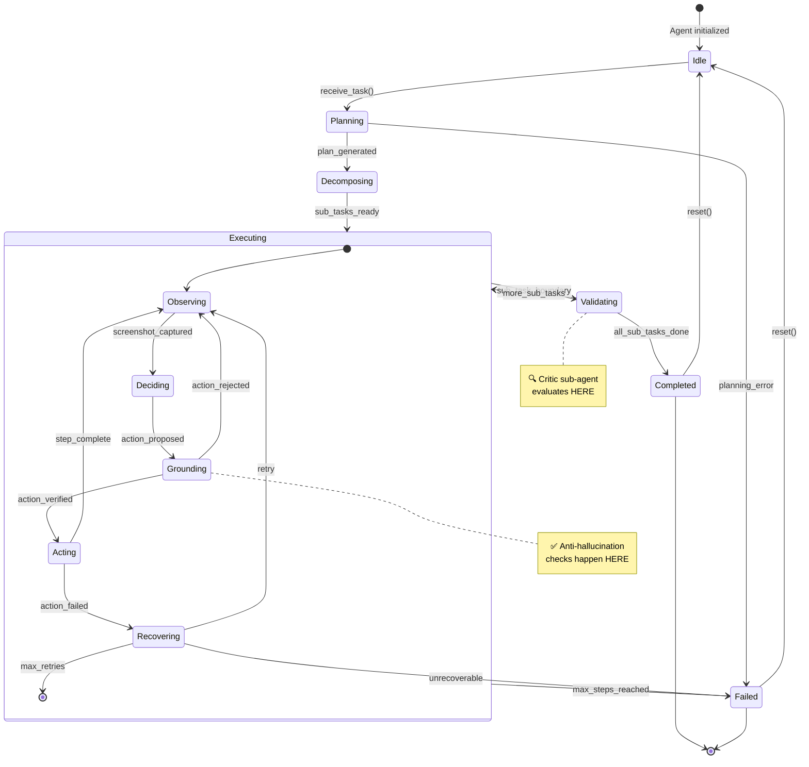

---

### Error Recovery Strategy

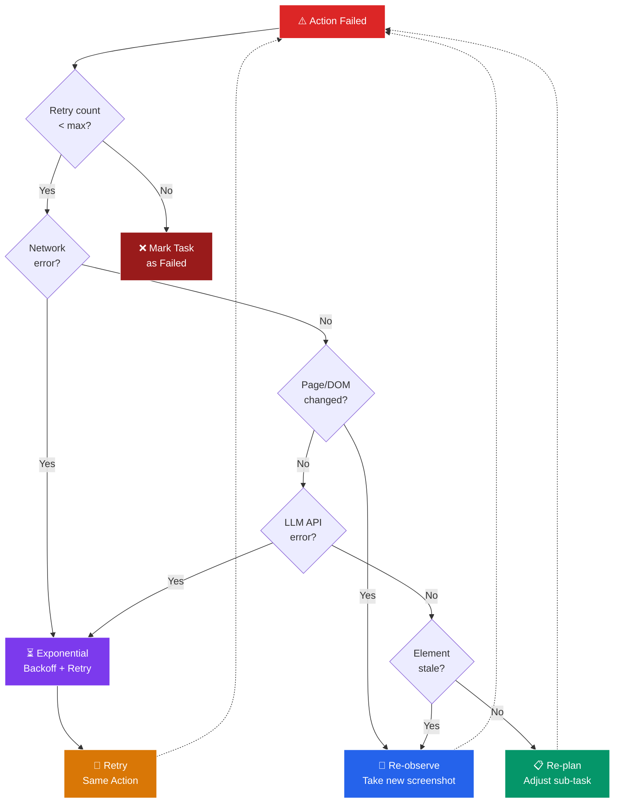

---

### API Request/Response Flow

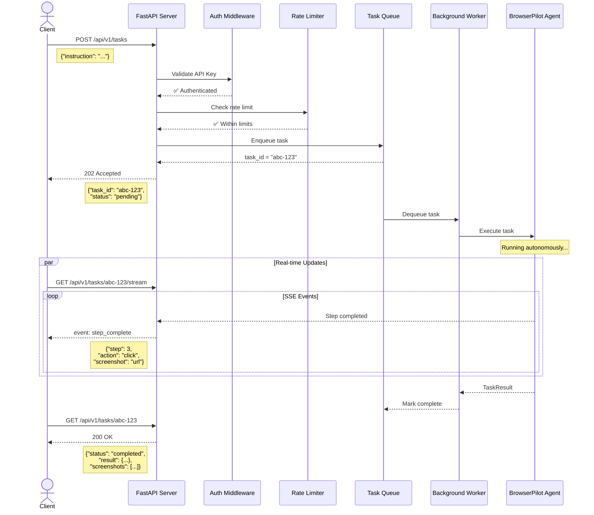

---

### Data Model Relationships

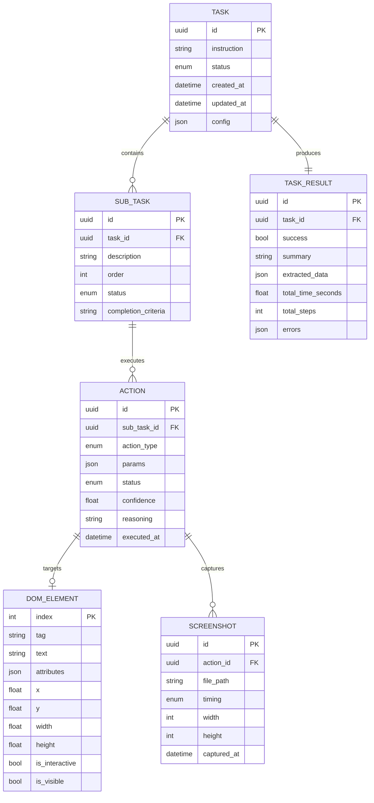

---

### Token Budget Distribution

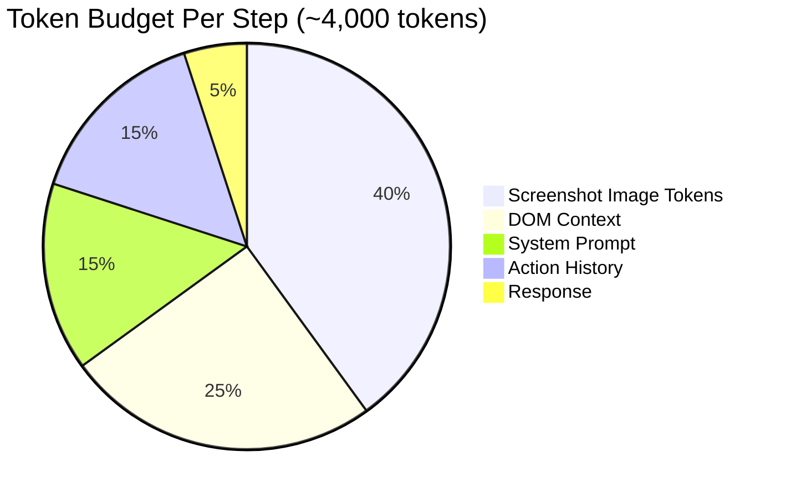

---

### Module Dependency Graph

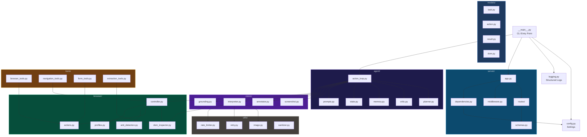

---

### Browser Automation Layer

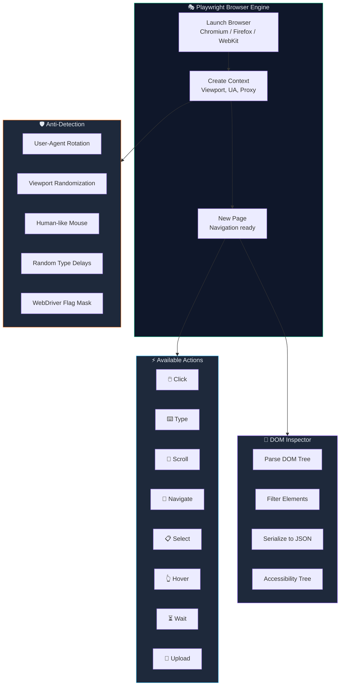

---

### Critic Validation Workflow

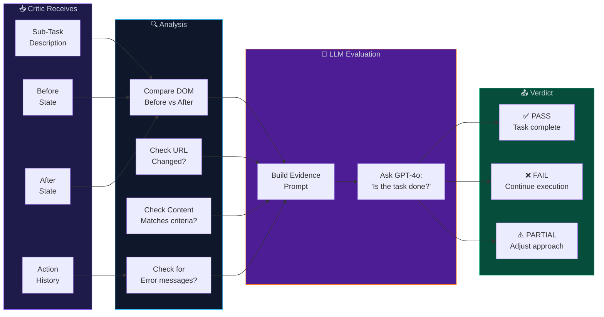

---

### Memory & Context Management

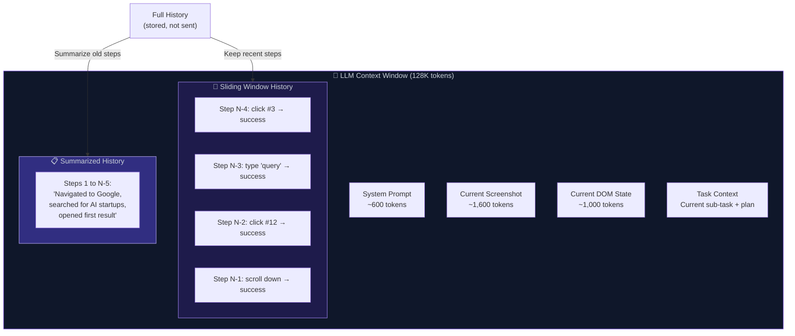

---

## 🚀 Quick Start

### Prerequisites

- Python 3.12+
- [uv](https://docs.astral.sh/uv/) package manager
- OpenAI API key (GPT-4o access)

### Installation

```bash
# Clone the repository
git clone https://github.com/chirag127/BrowserPilot.git
cd BrowserPilot

# Install dependencies with uv
uv sync

# Install Playwright browsers
uv run playwright install chromium

# Create your .env file
cp .env.example .env
# Edit .env and add your OPENAI_API_KEY
```

### First Run

```bash
# Run a simple task
uv run browserpilot run "Go to google.com and search for 'BrowserPilot'"

# Start the API server
uv run browserpilot serve --port 8000

# Check task status
uv run browserpilot status <task_id>
```

---

## 📖 Usage

### CLI Mode

```bash
# Simple navigation
uv run browserpilot run "Navigate to github.com and find the trending repositories"

# Form filling
uv run browserpilot run "Go to example.com/contact and fill the form with name: John, email: john@example.com"

# Data extraction
uv run browserpilot run "Go to news.ycombinator.com and extract the top 10 post titles"

# Complex multi-step task
uv run browserpilot run "Research the top 5 AI startups of 2025, find their funding amounts, and save the data as a JSON file"

# With options
uv run browserpilot run "Search Google for 'Python tutorials'" \
  --max-steps 30 \
  --headless false \
  --screenshot-dir ./my-screenshots
```

### API Mode

```bash
# Start the server
uv run browserpilot serve --host 0.0.0.0 --port 8000

# Create a task
curl -X POST http://localhost:8000/api/v1/tasks \
  -H "Content-Type: application/json" \
  -H "X-API-Key: your-api-key" \
  -d '{"instruction": "Search Google for BrowserPilot"}'

# Get task status
curl http://localhost:8000/api/v1/tasks/<task_id> \
  -H "X-API-Key: your-api-key"

# Stream live updates (SSE)
curl http://localhost:8000/api/v1/tasks/<task_id>/stream \
  -H "X-API-Key: your-api-key"
```

### Python SDK

```python
import asyncio
from browser_pilot import BrowserPilot

async def main():
    pilot = BrowserPilot(
        model="gpt-4o",
        headless=True,
        max_steps=30,
    )

    result = await pilot.run(
        "Go to github.com/trending and extract "
        "the top 5 repository names and descriptions"
    )

    print(f"Success: {result.success}")
    print(f"Steps taken: {result.total_steps}")
    print(f"Extracted data: {result.extracted_data}")

    for screenshot in result.screenshots:
        print(f"Screenshot: {screenshot}")

asyncio.run(main())
```

---

## 📡 API Reference

### Endpoints

| Method | Endpoint | Description |
|--------|----------|-------------|
| `POST` | `/api/v1/tasks` | Create a new task |
| `GET` | `/api/v1/tasks/{id}` | Get task status & result |
| `GET` | `/api/v1/tasks` | List all tasks (paginated) |
| `DELETE` | `/api/v1/tasks/{id}` | Cancel a running task |
| `GET` | `/api/v1/tasks/{id}/stream` | SSE live updates |
| `WS` | `/api/v1/ws` | WebSocket connection |
| `GET` | `/api/v1/tasks/{id}/screenshots` | Get screenshots |
| `GET` | `/api/v1/health` | Health check |

### Create Task Request

```json
{
  "instruction": "Search Google for 'AI news' and extract the top 5 results",
  "config": {
    "max_steps": 30,
    "headless": true,
    "browser_type": "chromium",
    "screenshot_on_action": true
  }
}
```

### Task Response

```json
{
  "id": "550e8400-e29b-41d4-a716-446655440000",
  "instruction": "Search Google for 'AI news'...",
  "status": "completed",
  "result": {
    "success": true,
    "summary": "Successfully extracted top 5 AI news results",
    "extracted_data": {
      "results": [
        {"title": "...", "url": "...", "snippet": "..."},
      ]
    },
    "total_time_seconds": 45.2,
    "total_steps": 8,
    "errors": []
  },
  "screenshots": [
    "/api/v1/tasks/550e.../screenshots/step_1.png",
    "/api/v1/tasks/550e.../screenshots/step_2.png"
  ],
  "created_at": "2026-03-29T12:00:00Z",
  "updated_at": "2026-03-29T12:00:45Z"
}
```

---

## 🔧 How It Works

### The Core Loop: Observe → Decide → Act

BrowserPilot operates on a continuous loop that mirrors how a
human would interact with a web browser:

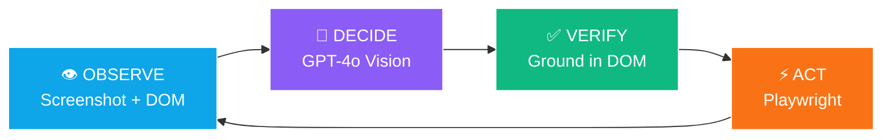

1. **OBSERVE**: Take a screenshot of the current page and extract
   the DOM tree. Interactive elements are numbered and overlaid on
   the screenshot (Set-of-Marks technique).

2. **DECIDE**: Send the annotated screenshot + DOM context + task
   history to GPT-4o Vision. The LLM analyzes the page and proposes
   the next action (e.g., "click element #7" or "type 'hello'
   into element #3").

3. **VERIFY**: Before executing, the Grounding module verifies
   the proposed action against the live DOM state. This prevents
   the LLM from "hallucinating" actions on elements that don't
   exist, aren't visible, or have changed since the screenshot.

4. **ACT**: Execute the verified action using Playwright. Record
   the before/after state. Update the action history.

5. **VALIDATE**: After each sub-task boundary, the Critic sub-agent
   evaluates whether the sub-task has been completed by comparing
   the before/after states and checking explicit completion criteria.

---

## ⚙️ Configuration

### Environment Variables

| Variable | Default | Description |
|----------|---------|-------------|
| `OPENAI_API_KEY` | _required_ | Your OpenAI API key |
| `OPENAI_MODEL` | `gpt-4o` | Model to use for vision |
| `BROWSER_HEADLESS` | `true` | Run browser headlessly |
| `BROWSER_TYPE` | `chromium` | Browser engine |
| `MAX_STEPS` | `50` | Max steps per task |
| `STEP_TIMEOUT` | `120` | Seconds per step timeout |
| `MAX_FAILURES` | `5` | Max consecutive failures |
| `API_HOST` | `0.0.0.0` | API server host |
| `API_PORT` | `8000` | API server port |
| `API_KEY` | _none_ | API authentication key |
| `LOG_LEVEL` | `INFO` | Logging verbosity |
| `SCREENSHOT_DIR` | `./screenshots` | Screenshot save path |
| `RECORDING_DIR` | `./recordings` | Video recording path |

### Configuration File

```python
# Custom configuration via Python
from browser_pilot.config import Settings

settings = Settings(
    openai_model="gpt-4o",
    browser_headless=False,
    max_steps=30,
    step_timeout=60,
    max_failures=3,
)
```

---

## 🧪 Testing

### Test Architecture

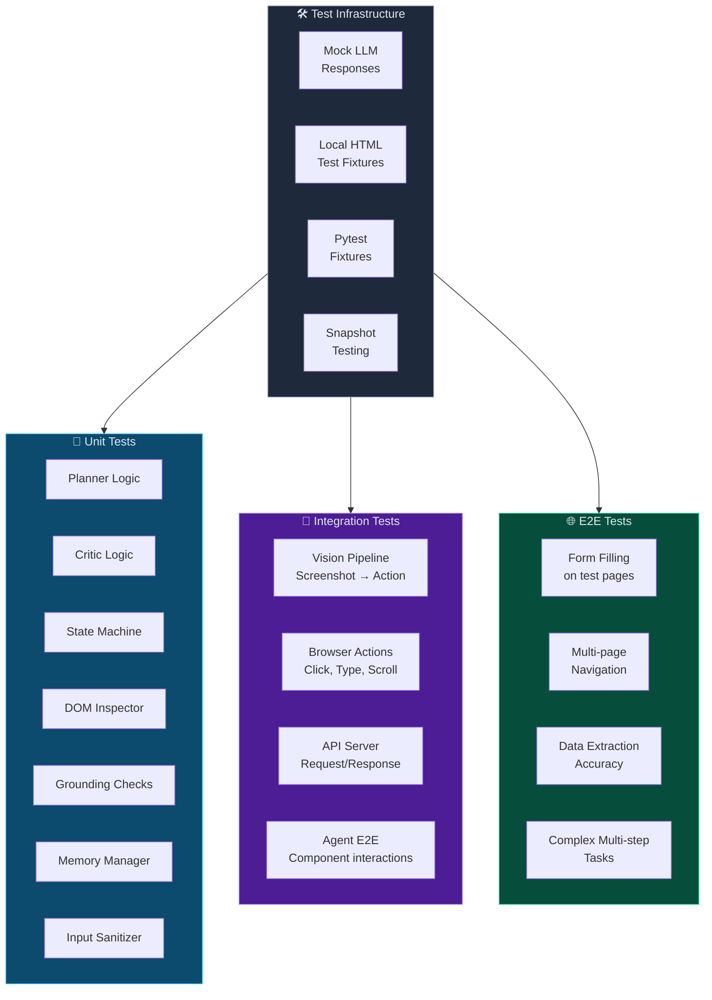

### Running Tests

```bash
# All tests
uv run pytest -v

# Unit tests only
uv run pytest tests/unit/ -v

# Integration tests
uv run pytest tests/integration/ -v

# E2E tests (requires browser)
uv run pytest tests/e2e/ -v

# With coverage
uv run pytest --cov=browser_pilot --cov-report=html

# Specific test
uv run pytest tests/unit/test_planner.py -v
```

---

## 🔒 Security

### Safety Measures

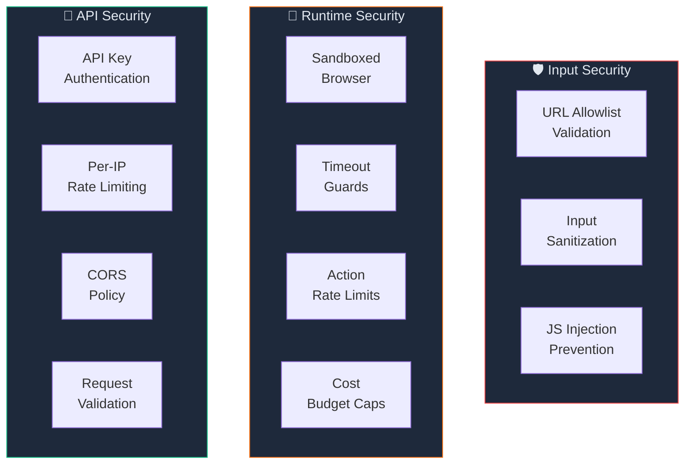

- **Never run with elevated privileges** — always use a non-root user
- **URL allowlists** — restrict which domains the agent can visit
- **Action budgets** — limit total API cost per task
- **Timeout guards** — prevent infinite loops
- **Input sanitization** — prevent prompt injection attacks
- **Secrets in `.env`** — never hardcoded

---

## 📂 Project Structure

```
BrowserPilot/
├── .github/workflows/        # CI/CD pipelines
├── src/browser_pilot/
│   ├── agent/                 # 🧠 Core agent logic
│   │   ├── action_loop.py     #    Main observe-decide-act loop
│   │   ├── planner.py         #    Task decomposition
│   │   ├── critic.py          #    Completion validation
│   │   ├── memory.py          #    Context management
│   │   ├── prompts.py         #    LLM prompt templates
│   │   └── state.py           #    Agent state machine
│   ├── vision/                # 👁️ Vision pipeline
│   │   ├── screenshot.py      #    Screenshot capture
│   │   ├── annotator.py       #    DOM element overlay
│   │   ├── interpreter.py     #    GPT-4o vision analysis
│   │   └── grounding.py       #    Anti-hallucination checks
│   ├── browser/               # 🌐 Browser automation
│   │   ├── controller.py      #    Playwright lifecycle
│   │   ├── dom_inspector.py   #    DOM tree extraction
│   │   ├── actions.py         #    Click, type, scroll, etc.
│   │   ├── anti_detection.py  #    Stealth features
│   │   └── profiles.py        #    Browser profiles
│   ├── server/                # 🖥️ FastAPI server
│   │   ├── app.py             #    Application factory
│   │   ├── routes/            #    API endpoints
│   │   ├── middleware.py      #    Auth & rate limiting
│   │   └── schemas.py         #    Request/response models
│   ├── tools/                 # 🛠️ LangChain tools
│   ├── models/                # 📦 Data models
│   └── utils/                 # 🔧 Utilities
├── tests/                     # 🧪 Test suites
├── examples/                  # 📝 Usage examples
├── docs/                      # 📚 Documentation
├── .env.example               # Environment template
├── pyproject.toml             # Project configuration
└── README.md                  # This file
```

---

## 🔄 CI/CD Pipeline

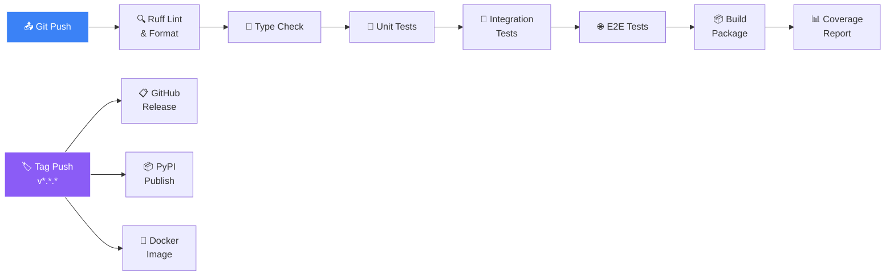

All test jobs use `continue-on-error: true` so every test
suite runs regardless of individual failures.

---

## 🤝 Contributing

We welcome contributions! Please see the following workflow:

```mermaid
gitgraph
    commit id: "main"
    branch feature/my-feature
    checkout feature/my-feature
    commit id: "feat: add feature"
    commit id: "test: add tests"
    commit id: "docs: update README"
    checkout main
    merge feature/my-feature
    commit id: "release: v1.0.0" tag: "v1.0.0"
```

1. **Fork** the repository
2. **Create** a feature branch (`git checkout -b feature/amazing`)
3. **Write tests** first (TDD approach)
4. **Implement** the feature
5. **Run** linting: `uv run ruff check .`
6. **Run** tests: `uv run pytest -v`
7. **Commit** with conventional commits
8. **Push** and open a Pull Request

### Commit Convention

| Prefix | Usage |
|--------|-------|
| `feat:` | New feature |
| `fix:` | Bug fix |
| `docs:` | Documentation |
| `test:` | Tests |
| `refactor:` | Code refactoring |
| `perf:` | Performance |
| `ci:` | CI/CD changes |
| `chore:` | Maintenance |

---

## 📄 License

This project is licensed under the MIT License. See [LICENSE](LICENSE)
for details.

---

## 🙏 Acknowledgments

- [browser-use](https://github.com/browser-use/browser-use) —
  Core agentic browser framework
- [Playwright](https://playwright.dev/) — Browser automation
- [LangChain](https://www.langchain.com/) — LLM orchestration
- [OpenAI](https://openai.com/) — GPT-4o vision model
- [FastAPI](https://fastapi.tiangolo.com/) — API framework

---

<p align="center">
  Built with ❤️ by <a href="https://github.com/chirag127">Chirag Singhal</a>
</p>
