# BrowserPilot — Autonomous Browser Agent: Implementation Plan

> **Goal**: Build a production-grade, fully autonomous browser agent that
> accepts plain-English instructions and executes multi-step web tasks
> using GPT-4o vision, Playwright, LangChain, and FastAPI.

---

## User Review Required

> [!IMPORTANT]
> **OpenAI API Key**: The project requires an `OPENAI_API_KEY` with
> GPT-4o (vision) access. Confirm you have one before proceeding.

> [!IMPORTANT]
> **Python Version**: Targeting Python 3.12+. Confirm your local
> Python version meets this requirement.

> [!WARNING]
> **Cost Implications**: GPT-4o vision calls are billed per image
> token. Each screenshot-based step will incur API costs. Consider
> adding budget caps and rate limiting.

> [!CAUTION]
> **Security**: The agent will control a real browser. Implement
> sandboxing, URL allowlists, and action guardrails to prevent
> misuse. Never run in production without proper isolation.

---

## 1. Project Overview

BrowserPilot is an AI agent that autonomously controls a web browser
to complete tasks described in natural language. It combines:

- **GPT-4o Vision** — Multimodal LLM for screenshot interpretation
  and DOM-grounded action decisions
- **Playwright** — Cross-browser automation (Chromium/Firefox/WebKit)
- **LangChain** — Agent orchestration, tool management, memory
- **FastAPI** — REST/WebSocket API server for external integrations
- **browser-use** — Open-source agentic browser framework as the
  core engine

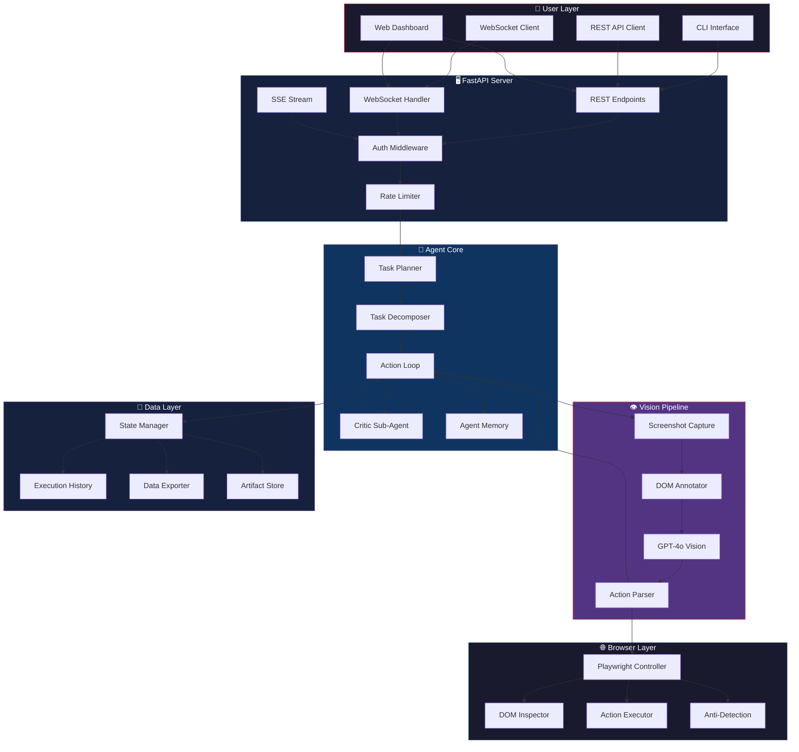

---

## 2. Technology Stack & Versions

| Technology      | Version  | Purpose                              |
|-----------------|----------|--------------------------------------|
| Python          | 3.12+    | Runtime                              |
| browser-use     | ^1.0     | Core agentic browser framework       |
| Playwright      | ^1.51    | Browser automation engine            |
| LangChain       | ^0.3     | LLM orchestration & agent tools      |
| langchain-openai| ^0.3     | OpenAI GPT-4o integration            |
| FastAPI         | ^0.128   | REST/WebSocket API server            |
| Uvicorn         | ^0.34    | ASGI server                          |
| Pydantic        | ^2.10    | Data validation & settings           |
| openai          | ^1.60    | Direct OpenAI API (fallback)         |
| Pillow          | ^11.1    | Image processing for screenshots     |
| aiohttp         | ^3.11    | Async HTTP client                    |
| structlog       | ^24.4    | Structured logging                   |
| python-dotenv   | ^1.0     | Environment variable management      |
| pytest          | ^8.3     | Unit & integration testing           |
| pytest-asyncio  | ^0.24    | Async test support                   |
| pytest-playwright| ^0.6    | Playwright test fixtures             |
| ruff            | ^0.9     | Linter & formatter                   |
| uv              | latest   | Package manager                      |

---

## 3. Repository Structure

```
BrowserPilot/
├── .github/
│   └── workflows/
│       ├── ci.yml                  # CI pipeline
│       └── release.yml             # Release workflow
├── src/
│   └── browser_pilot/
│       ├── __init__.py
│       ├── __main__.py             # CLI entry point
│       ├── config.py               # Pydantic settings
│       ├── logging.py              # Structured logging setup
│       │
│       ├── agent/                  # Core agent logic
│       │   ├── __init__.py
│       │   ├── action_loop.py      # Main observe-decide-act loop
│       │   ├── planner.py          # Task decomposition planner
│       │   ├── critic.py           # Critic sub-agent
│       │   ├── memory.py           # Agent memory / context
│       │   ├── prompts.py          # System prompts & templates
│       │   └── state.py            # Agent state machine
│       │
│       ├── vision/                 # Vision pipeline
│       │   ├── __init__.py
│       │   ├── screenshot.py       # Screenshot capture & crop
│       │   ├── annotator.py        # DOM element annotation
│       │   ├── interpreter.py      # GPT-4o vision analysis
│       │   └── grounding.py        # DOM grounding & verify
│       │
│       ├── browser/                # Browser automation
│       │   ├── __init__.py
│       │   ├── controller.py       # Playwright lifecycle
│       │   ├── dom_inspector.py    # DOM tree extraction
│       │   ├── actions.py          # Click, type, scroll, nav
│       │   ├── anti_detection.py   # Stealth & anti-bot
│       │   └── profiles.py         # Browser profile manager
│       │
│       ├── server/                 # FastAPI server
│       │   ├── __init__.py
│       │   ├── app.py              # FastAPI application
│       │   ├── routes/
│       │   │   ├── __init__.py
│       │   │   ├── tasks.py        # Task CRUD endpoints
│       │   │   ├── health.py       # Health check
│       │   │   ├── stream.py       # SSE streaming
│       │   │   └── websocket.py    # WebSocket handler
│       │   ├── middleware.py       # Auth, CORS, rate limit
│       │   ├── schemas.py          # Request/response models
│       │   └── dependencies.py     # FastAPI dependencies
│       │
│       ├── tools/                  # LangChain tools
│       │   ├── __init__.py
│       │   ├── browser_tools.py    # Browser action tools
│       │   ├── extraction_tools.py # Data extraction tools
│       │   ├── navigation_tools.py # Navigation tools
│       │   └── form_tools.py       # Form interaction tools
│       │
│       ├── models/                 # Data models
│       │   ├── __init__.py
│       │   ├── task.py             # Task & sub-task models
│       │   ├── action.py           # Action models
│       │   ├── result.py           # Execution result models
│       │   └── dom.py              # DOM element models
│       │
│       └── utils/                  # Utilities
│           ├── __init__.py
│           ├── image.py            # Image processing utils
│           ├── retry.py            # Retry logic
│           ├── rate_limiter.py     # API rate limiter
│           └── sanitizer.py        # Input sanitization
│
├── tests/
│   ├── __init__.py
│   ├── conftest.py                 # Shared fixtures
│   ├── unit/
│   │   ├── __init__.py
│   │   ├── test_planner.py
│   │   ├── test_critic.py
│   │   ├── test_action_loop.py
│   │   ├── test_screenshot.py
│   │   ├── test_annotator.py
│   │   ├── test_dom_inspector.py
│   │   ├── test_actions.py
│   │   ├── test_grounding.py
│   │   ├── test_state.py
│   │   ├── test_memory.py
│   │   └── test_sanitizer.py
│   ├── integration/
│   │   ├── __init__.py
│   │   ├── test_vision_pipeline.py
│   │   ├── test_agent_e2e.py
│   │   ├── test_browser_actions.py
│   │   └── test_api_server.py
│   └── e2e/
│       ├── __init__.py
│       ├── test_form_filling.py
│       ├── test_navigation.py
│       ├── test_data_extraction.py
│       └── test_complex_tasks.py
│
├── docs/
│   ├── architecture.md
│   ├── api-reference.md
│   ├── development.md
│   └── examples.md
│
├── examples/
│   ├── search_and_extract.py
│   ├── fill_form.py
│   ├── multi_step_research.py
│   └── screenshot_analysis.py
│
├── .env.example
├── .gitignore
├── .python-version
├── pyproject.toml
├── uv.lock
├── LICENSE
└── README.md
```

---

## 4. Proposed Changes — Phase-by-Phase

### Phase 1: Project Foundation

#### [NEW] pyproject.toml
- Project metadata, dependencies, dev dependencies
- Ruff configuration (line-length=80, Python 3.12)
- pytest configuration
- Build system (hatchling)

#### [NEW] .env.example
```env
OPENAI_API_KEY=sk-...
OPENAI_MODEL=gpt-4o
BROWSER_HEADLESS=true
BROWSER_TYPE=chromium
MAX_STEPS=50
STEP_TIMEOUT=120
MAX_FAILURES=5
API_HOST=0.0.0.0
API_PORT=8000
API_KEY=your-api-key-here
LOG_LEVEL=INFO
SCREENSHOT_DIR=./screenshots
RECORDING_DIR=./recordings
```

#### [NEW] .gitignore
- Standard Python ignores + .env, screenshots/,
  recordings/, *.pyc, __pycache__, .venv/

#### [NEW] .python-version
```
3.12
```

---

### Phase 2: Configuration & Logging

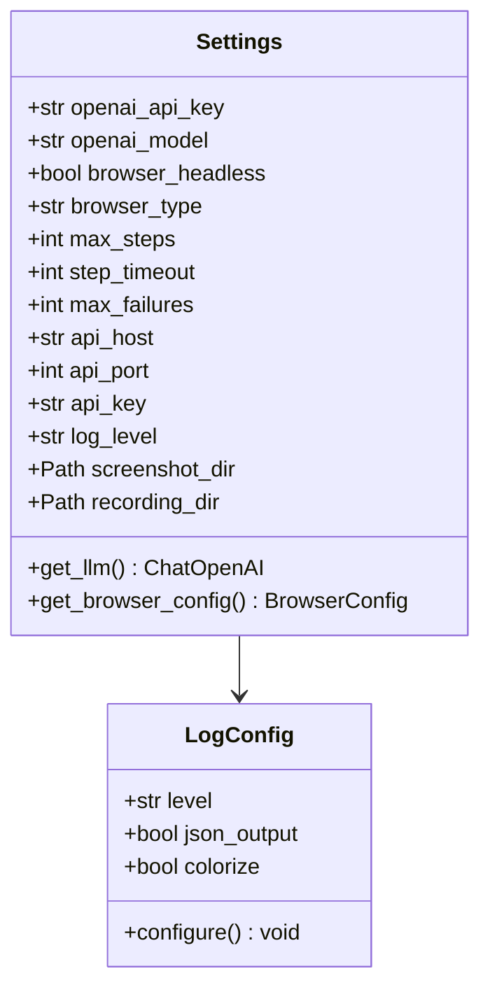

#### [NEW] src/browser_pilot/config.py
- Pydantic `BaseSettings` with `.env` file support
- Validated fields for all environment variables
- Factory methods: `get_llm()`, `get_browser_config()`
- Singleton pattern via `@lru_cache`

#### [NEW] src/browser_pilot/logging.py
- Structlog configuration with JSON & console renderers
- Correlation ID injection for request tracing
- Performance timing context manager

---

### Phase 3: Data Models

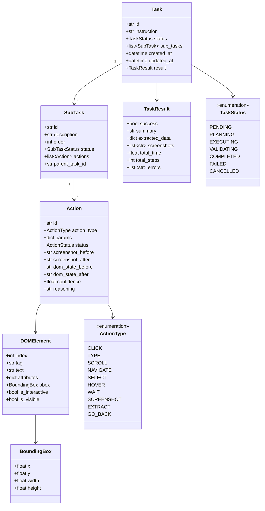

#### [NEW] src/browser_pilot/models/task.py
- `Task`, `SubTask` Pydantic models with status tracking
- `TaskResult` for completion data

#### [NEW] src/browser_pilot/models/action.py
- `Action` model with before/after state
- `ActionType` enum (click, type, scroll, navigate, etc.)

#### [NEW] src/browser_pilot/models/result.py
- `ExecutionResult`, `StepResult` models
- Serialization for API responses

#### [NEW] src/browser_pilot/models/dom.py
- `DOMElement`, `BoundingBox` models
- DOM tree representation for grounding

---

### Phase 4: Browser Automation Layer

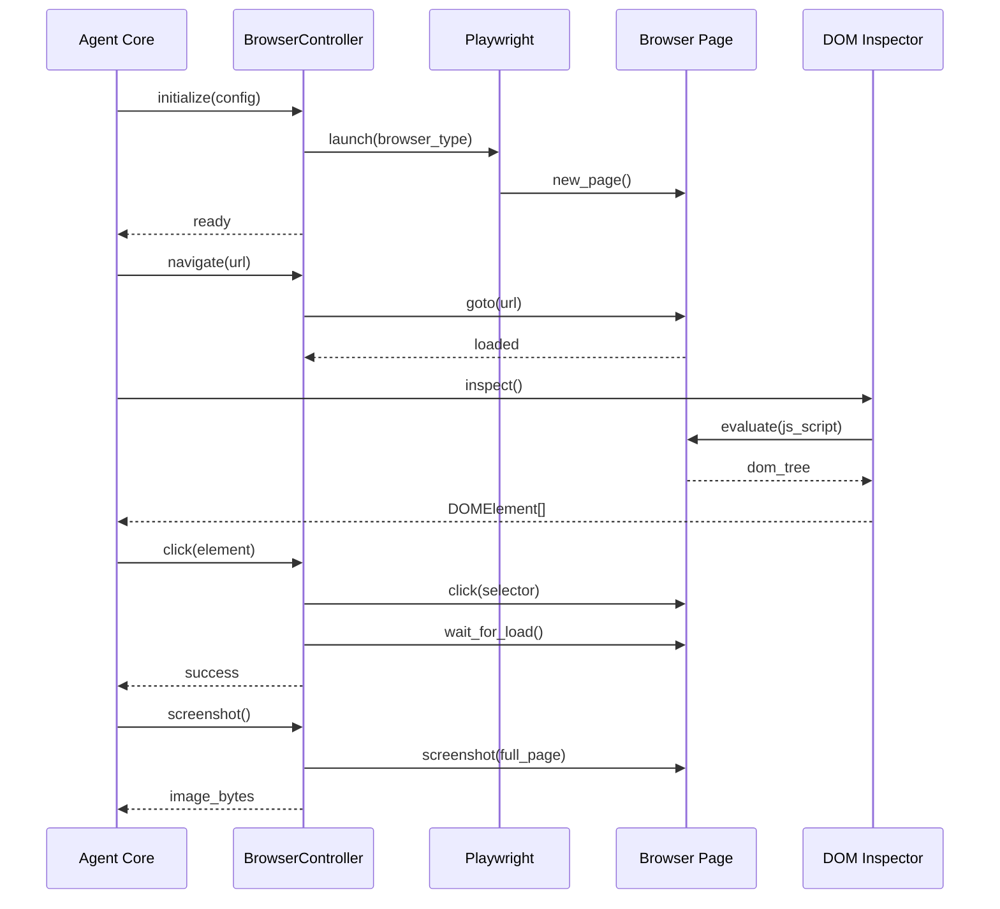

#### [NEW] src/browser_pilot/browser/controller.py
- `BrowserController` class wrapping Playwright
- Async lifecycle: `start()`, `stop()`, `restart()`
- Page management: `navigate()`, `go_back()`, `refresh()`
- Context manager support (`async with`)
- Video recording toggle
- Multiple browser type support (chromium, firefox, webkit)

#### [NEW] src/browser_pilot/browser/dom_inspector.py
- JavaScript injection for DOM tree extraction
- Filters: interactive-only, visible-only, within viewport
- Serialization to `DOMElement[]`
- Accessibility tree extraction
- Element indexing for vision annotation

#### [NEW] src/browser_pilot/browser/actions.py
- `click(element)` — Click with retry & verification
- `type_text(element, text)` — Type with human-like delay
- `scroll(direction, amount)` — Viewport scrolling
- `select_option(element, value)` — Dropdown selection
- `hover(element)` — Hover for tooltips/menus
- `press_key(key)` — Keyboard shortcuts
- `drag_and_drop(source, target)` — Drag operations
- `upload_file(element, path)` — File upload handling
- Each action returns `ActionResult` with success/failure

#### [NEW] src/browser_pilot/browser/anti_detection.py
- User-agent rotation
- Viewport randomization
- WebDriver flag masking
- Human-like mouse movement curves
- Randomized typing delays
- Cookie/fingerprint management

#### [NEW] src/browser_pilot/browser/profiles.py
- Browser profile creation & management
- Cookie persistence across sessions
- Proxy configuration
- Extension loading

---

### Phase 5: Vision Pipeline

```mermaid
flowchart LR
    subgraph Capture["📸 Capture"]
        SS["Take Screenshot"]
        CROP["Smart Crop"]
        RESIZE["Optimize Size"]
    end

    subgraph Annotate["🏷️ Annotate"]
        DOM_EX["Extract DOM"]
        BBOX["Bounding Boxes"]
        LABEL["Index Labels"]
        OVERLAY["Draw Overlays"]
    end

    subgraph Interpret["🧠 Interpret"]
        ENCODE["Base64 Encode"]
        PROMPT["Build Prompt"]
        VLM2["GPT-4o Vision"]
        PARSE2["Parse Response"]
    end

    subgraph Ground["✅ Ground"]
        VERIFY["Verify Element"]
        MATCH["DOM Matching"]
        CONF["Confidence Score"]
        DECIDE["Go / No-Go"]
    end

    SS --> CROP --> RESIZE
    RESIZE --> ENCODE
    SS --> DOM_EX --> BBOX --> LABEL --> OVERLAY
    OVERLAY --> ENCODE

    ENCODE --> PROMPT --> VLM2 --> PARSE2

    PARSE2 --> VERIFY --> MATCH --> CONF --> DECIDE

    style Capture fill:#1e3a5f,stroke:#4a90d9,color:#fff
    style Annotate fill:#2d1b4e,stroke:#8b5cf6,color:#fff
    style Interpret fill:#1e3a5f,stroke:#4a90d9,color:#fff
    style Ground fill:#1b4332,stroke:#40c057,color:#fff
```

#### [NEW] src/browser_pilot/vision/screenshot.py
- Full-page and viewport screenshot capture
- Smart cropping to region of interest
- Resolution optimization for API token efficiency
- Screenshot diffing between steps
- Artifact storage with naming convention

#### [NEW] src/browser_pilot/vision/annotator.py
- Overlay numbered bounding boxes on screenshots
- Color-coded by element type (input, button, link, etc.)
- Clickable region highlighting
- Set-of-Marks (SoM) prompting technique
- Clean image vs annotated image variants

#### [NEW] src/browser_pilot/vision/interpreter.py
- GPT-4o vision API integration
- Structured prompt engineering:
  - Current screenshot (annotated)
  - Current DOM state
  - Task context & history
  - Available actions
- Response parsing into `Action` objects
- Token usage tracking & budgeting
- Retry with exponential backoff on API errors

#### [NEW] src/browser_pilot/vision/grounding.py
- Verify proposed action against live DOM state
- Element existence check before execution
- Bounding box overlap verification
- Staleness detection (page changed since screenshot)
- Confidence scoring (0–1) for action validity
- Rejection threshold configuration

---

### Phase 6: Agent Core — The Brain

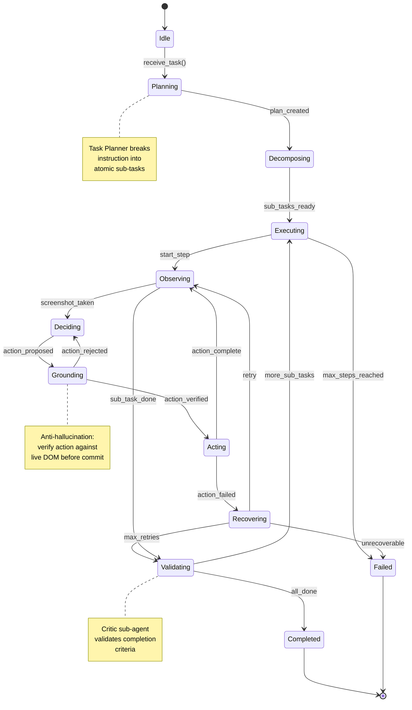

#### [NEW] src/browser_pilot/agent/action_loop.py
```python
# Pseudocode for the core loop
class ActionLoop:
    async def run(self, task: Task) -> TaskResult:
        """Main observe-decide-act loop."""
        plan = await self.planner.plan(task)
        for sub_task in plan.sub_tasks:
            for step in range(self.max_steps):
                # 1. OBSERVE — screenshot + DOM state
                screenshot = await self.vision.capture()
                dom_state = await self.browser.inspect_dom()
                annotated = await self.vision.annotate(
                    screenshot, dom_state
                )

                # 2. DECIDE — ask GPT-4o what to do
                action = await self.vision.interpret(
                    annotated, dom_state, sub_task, history
                )

                # 3. GROUND — verify before executing
                is_valid = await self.grounding.verify(
                    action, dom_state
                )
                if not is_valid:
                    continue  # re-observe

                # 4. ACT — execute the action
                result = await self.browser.execute(action)
                history.append(result)

                # 5. VALIDATE — check if sub-task done
                if await self.critic.is_done(sub_task):
                    break

        return self.compile_result(task, history)
```

- Step counter with configurable maximum
- Action history for context window
- Error recovery with configurable retry policy
- Timeout per step and per task
- Cancellation support via asyncio

#### [NEW] src/browser_pilot/agent/planner.py

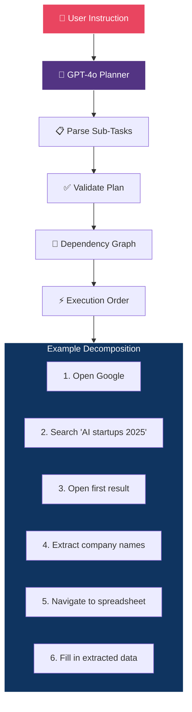

- Instruction → sub-task decomposition via LLM
- Dependency resolution between sub-tasks
- Dynamic re-planning when page changes unexpectedly
- Sub-task prioritization & ordering
- Plan serialization for resume capability
- Max sub-task limit to prevent infinite loops

#### [NEW] src/browser_pilot/agent/critic.py

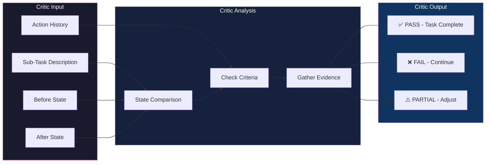

- Separate LLM call to evaluate task completion
- Compares before/after DOM states
- Checks explicit success criteria from sub-task
- Returns: PASS / FAIL / PARTIAL with reasoning
- Prevents premature "done" declarations
- Configurable strictness level

#### [NEW] src/browser_pilot/agent/memory.py
- Sliding window context management
- Summarization of old steps to save tokens
- Key observation extraction & persistence
- Cross-sub-task knowledge transfer
- Token budget tracking

#### [NEW] src/browser_pilot/agent/prompts.py
- System prompts for each LLM role:
  - **Planner**: Task decomposition instructions
  - **Actor**: Action decision instructions
  - **Critic**: Completion validation instructions
  - **Summarizer**: Context compression instructions
- Few-shot examples for each prompt
- Dynamic prompt construction with context injection

#### [NEW] src/browser_pilot/agent/state.py
- Finite state machine for agent lifecycle
- State transitions with validation
- Serializable state for persistence/resume
- Event hooks for state changes

---

### Phase 7: LangChain Tool Integration

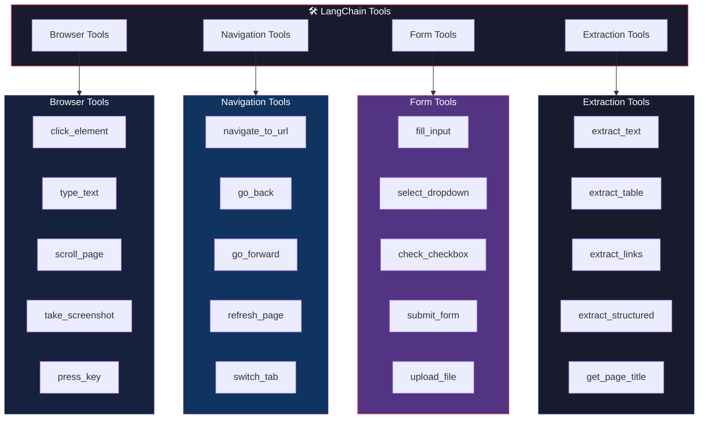

#### [NEW] src/browser_pilot/tools/browser_tools.py
- `@tool` decorated functions for browser actions
- Input validation via Pydantic schemas
- Return structured results with success/failure
- Error messages useful for LLM self-correction

#### [NEW] src/browser_pilot/tools/navigation_tools.py
- URL navigation with wait-for-load
- Tab management tools
- History navigation (back/forward)
- URL validation and sanitization

#### [NEW] src/browser_pilot/tools/form_tools.py
- Form field detection and filling
- Dropdown/select handling
- Checkbox/radio button toggling
- File upload via file chooser
- Form submission with confirmation

#### [NEW] src/browser_pilot/tools/extraction_tools.py
- Text extraction from selectors
- Table extraction to structured data
- Link harvesting with metadata
- Structured data extraction via schemas
- Screenshot-to-text (OCR fallback)

---

### Phase 8: FastAPI Server

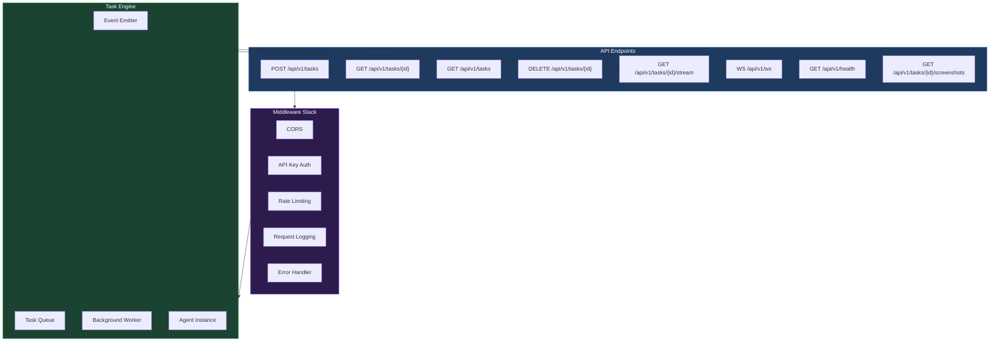

#### [NEW] src/browser_pilot/server/app.py
- FastAPI application factory
- CORS, docs configuration
- Lifespan events (startup/shutdown)
- Browser pool initialization

#### [NEW] src/browser_pilot/server/routes/tasks.py
- `POST /api/v1/tasks` — Create & enqueue task
- `GET /api/v1/tasks/{id}` — Get task status
- `GET /api/v1/tasks` — List all tasks (paginated)
- `DELETE /api/v1/tasks/{id}` — Cancel task
- `GET /api/v1/tasks/{id}/screenshots` — Get screenshots

#### [NEW] src/browser_pilot/server/routes/stream.py
- `GET /api/v1/tasks/{id}/stream` — SSE endpoint
- Real-time action updates
- Screenshot URLs in events
- Step completion notifications
- Error event streaming

#### [NEW] src/browser_pilot/server/routes/websocket.py
- `WS /api/v1/ws` — Bidirectional WebSocket
- Live screenshot streaming
- Interactive task control (pause/resume/cancel)
- Action-by-action progress reporting

#### [NEW] src/browser_pilot/server/routes/health.py
- `GET /api/v1/health` — Server health check
- Browser pool status
- Memory usage
- Active task count

#### [NEW] src/browser_pilot/server/middleware.py
- API key authentication
- Rate limiting (per-IP and per-key)
- CORS configuration
- Request/response logging

#### [NEW] src/browser_pilot/server/schemas.py
- `CreateTaskRequest` / `CreateTaskResponse`
- `TaskStatusResponse`
- `TaskListResponse` with pagination
- `StreamEvent` for SSE
- `WebSocketMessage` for WS
- `ErrorResponse`

#### [NEW] src/browser_pilot/server/dependencies.py
- Settings dependency injection
- Browser pool dependency
- Agent factory dependency
- Auth dependency

---

### Phase 9: CLI Interface

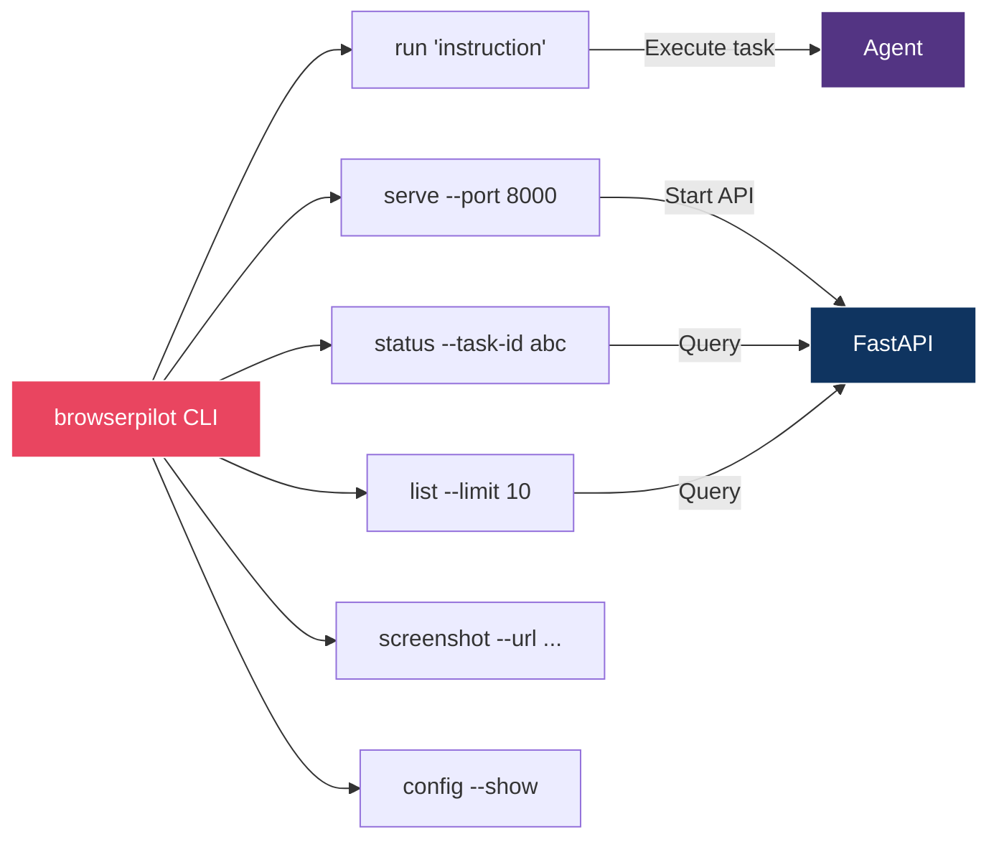

#### [NEW] src/browser_pilot/__main__.py
- `browserpilot run "instruction"` — Execute a task
- `browserpilot serve` — Start API server
- `browserpilot status <task_id>` — Check task status
- `browserpilot list` — List recent tasks
- `browserpilot config` — Show current configuration
- Rich terminal output with progress bars
- Argument parsing via `argparse` or `click`

---

### Phase 10: Utilities

#### [NEW] src/browser_pilot/utils/image.py
- Screenshot compression & optimization
- Base64 encoding/decoding
- Image diffing between steps
- Thumbnail generation
- Token-count estimation for images

#### [NEW] src/browser_pilot/utils/retry.py
- Configurable retry decorator
- Exponential backoff with jitter
- Exception type filtering
- Max attempts & timeout

#### [NEW] src/browser_pilot/utils/rate_limiter.py
- Token bucket rate limiter for OpenAI API
- Concurrent request limiter
- Per-minute and per-day budgets
- Cost estimation & alerts

#### [NEW] src/browser_pilot/utils/sanitizer.py
- URL sanitization & validation
- Input text sanitization
- JavaScript injection prevention
- File path sanitization

---

### Phase 11: Testing Infrastructure

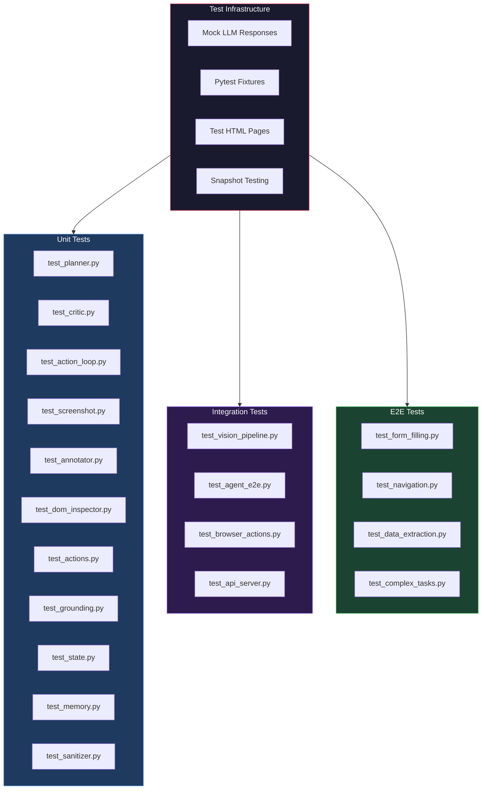

#### [NEW] tests/conftest.py
- Shared fixtures: mock LLM, test browser, test pages
- Async event loop configuration
- Temporary directory management
- Environment variable mocking

#### Unit Tests (11 files)
- Mock all external dependencies (LLM, browser)
- Test pure logic: planning, grounding, state machine
- Edge cases: empty DOM, timeout, invalid actions
- Minimum 90% code coverage target

#### Integration Tests (4 files)
- Test component interactions with real browser
- Vision pipeline end-to-end (screenshot → action)
- API server with test client
- Database operations if applicable

#### E2E Tests (4 files)
- Full task execution on test websites
- Form filling on a local HTML fixture
- Multi-page navigation scenarios
- Data extraction accuracy validation

---

### Phase 12: CI/CD & Deployment

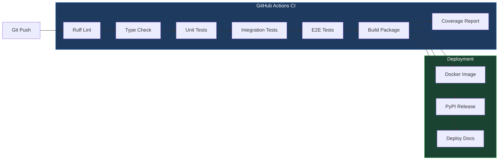

#### [NEW] .github/workflows/ci.yml
```yaml
name: CI
on: [push, pull_request]
jobs:
  lint:
    runs-on: ubuntu-latest
    steps:
      - uses: actions/checkout@v4
      - uses: astral-sh/setup-uv@v5
      - run: uv run ruff check .
      - run: uv run ruff format --check .

  test:
    runs-on: ubuntu-latest
    continue-on-error: true
    steps:
      - uses: actions/checkout@v4
      - uses: astral-sh/setup-uv@v5
      - run: uv sync --all-extras
      - run: npx playwright install chromium
      - run: uv run pytest tests/unit/ -v
        continue-on-error: true
      - run: uv run pytest tests/integration/ -v
        continue-on-error: true
      - run: uv run pytest tests/e2e/ -v
        continue-on-error: true

  build:
    runs-on: ubuntu-latest
    needs: [lint, test]
    steps:
      - uses: actions/checkout@v4
      - uses: astral-sh/setup-uv@v5
      - run: uv build
```

#### [NEW] .github/workflows/release.yml
- Triggered on tag push (v*)
- Build & publish to PyPI
- Create GitHub release
- Build & push Docker image

#### [NEW] Dockerfile
- Multi-stage build
- Python 3.12 slim base
- Playwright dependencies
- Non-root user
- Health check endpoint

---

## 5. Data Flow Diagrams

### Complete Task Execution Flow

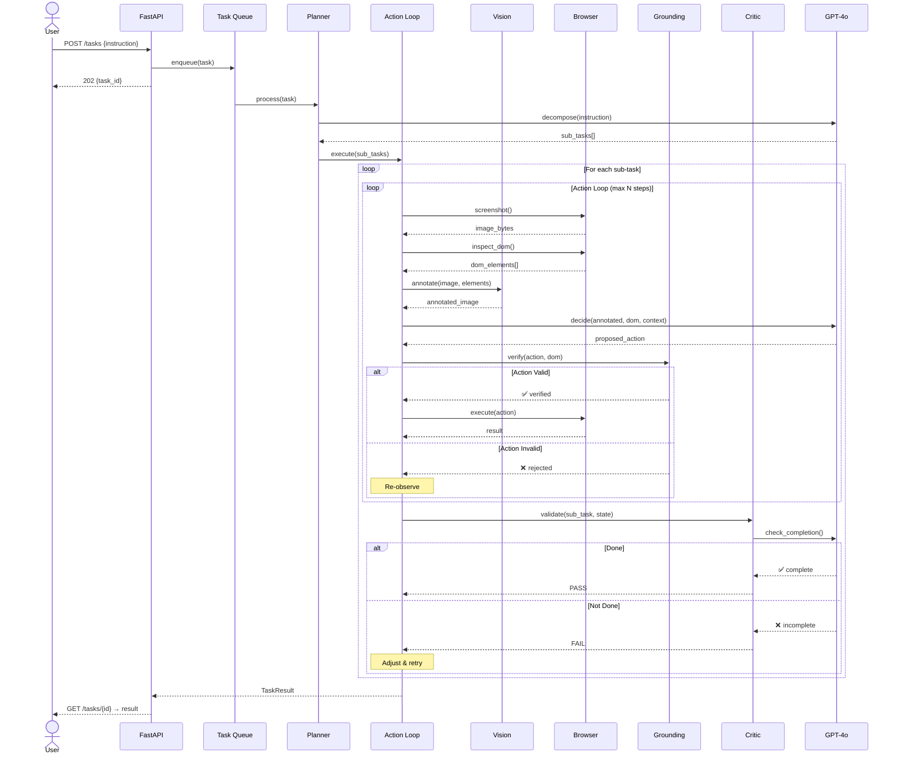

### Vision Pipeline Detail

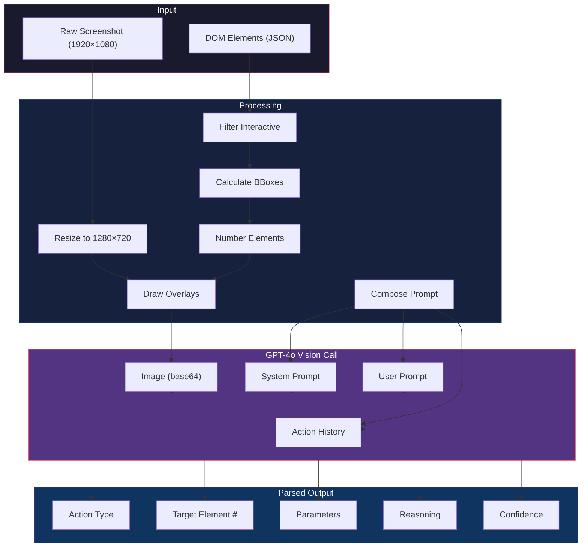

---

## 6. Anti-Hallucination Grounding Strategy

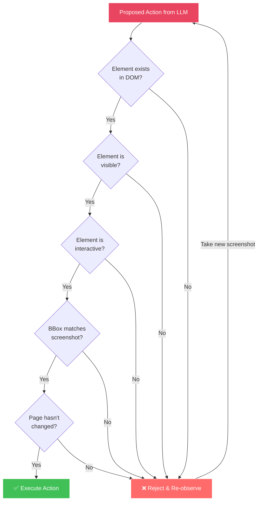

The grounding system performs 5 verification checks before any
action is committed:

1. **Element Existence** — Is the target element in the current DOM?
2. **Element Visibility** — Is the element visible in the viewport?
3. **Interactivity** — Is the element actually interactive
   (button, input, link)?
4. **Bounding Box Match** — Does the element's position match
   what the LLM saw in the screenshot?
5. **Page Freshness** — Has the page changed since the screenshot
   was taken?

If any check fails, the action is rejected and the agent
re-observes the page before deciding again.

---

## 7. Error Recovery Strategy

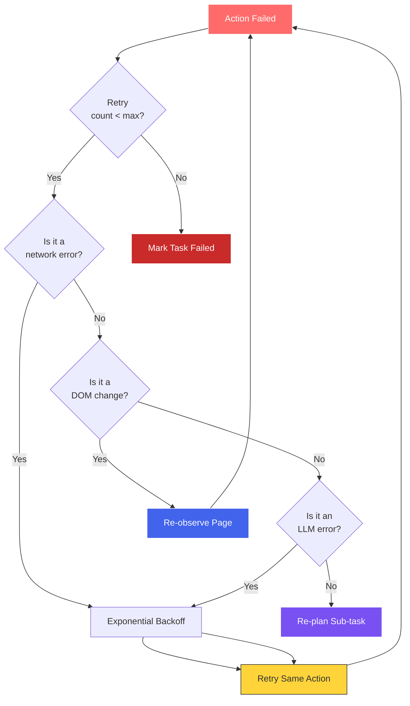

---

## 8. Performance & Cost Optimization

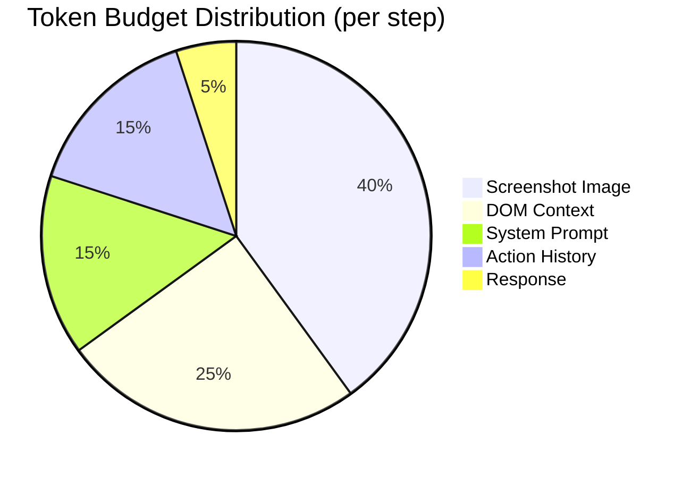

| Optimization                    | Impact                        |
|---------------------------------|-------------------------------|
| Screenshot downscaling          | –60% image tokens             |
| DOM filtering (interactive only)| –70% context tokens           |
| History summarization           | –50% history tokens           |
| Prompt caching (Anthropic)      | –50% on repeated prompts      |
| Batch grounding checks          | –30% DOM queries              |
| Step-level caching              | Skip unchanged pages          |

---

## Open Questions

> [!IMPORTANT]
> **LLM Provider**: Should we support multiple LLM providers
> (Anthropic Claude, Google Gemini) in addition to GPT-4o, or
> focus exclusively on GPT-4o for v1?

> [!IMPORTANT]
> **Persistence**: Should task state be persisted to a database
> (SQLite? PostgreSQL?) for crash recovery, or is in-memory
> sufficient for v1?

> [!IMPORTANT]
> **Concurrency**: How many simultaneous browser sessions should
> the server support? Each session requires ~200MB RAM for the
> browser process.

> [!WARNING]
> **browser-use Integration**: Should we build directly on top
> of the `browser-use` library (which provides the agent loop),
> or implement our own agent loop from scratch using raw
> Playwright + LangChain? The former is faster but less flexible.

---

## Verification Plan

### Automated Tests

| Test Suite       | Command                              | Coverage     |
|------------------|--------------------------------------|--------------|
| Unit Tests       | `uv run pytest tests/unit/ -v`       | 90%+ target  |
| Integration      | `uv run pytest tests/integration/ -v`| Core flows   |
| E2E              | `uv run pytest tests/e2e/ -v`        | Happy paths  |
| Lint             | `uv run ruff check .`                | Zero errors  |
| Format           | `uv run ruff format --check .`       | Zero diffs   |

### Manual Verification
1. Run a simple navigation task via CLI
2. Run a form-filling task via CLI
3. Run a data extraction task via CLI
4. Start the API server and test via curl/Postman
5. Verify WebSocket streaming in a browser client
6. Check screenshot artifacts are saved correctly
7. Verify the critic correctly rejects incomplete tasks
8. Test anti-hallucination by removing an element mid-task

### Performance Benchmarks
- Task: "Search Google for 'BrowserPilot' and extract the top 5 results"
  - Target: < 60 seconds, < 15 steps
  - Token budget: < 50,000 tokens total
